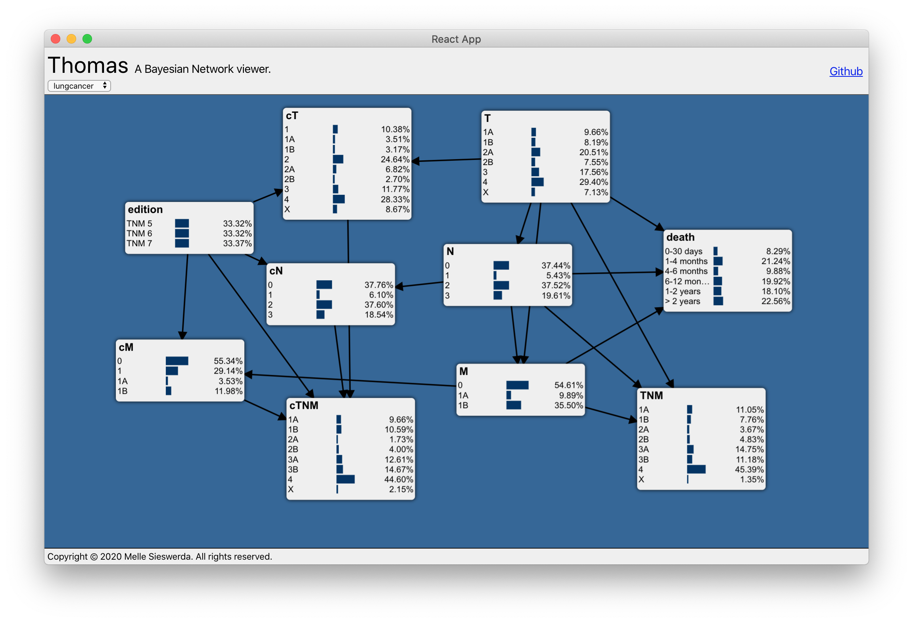

# Thomas
Thomas (yes, I know it's not a very original name) is an application lets you view and interact with Bayesian Networks. It consists of a client (which runs in the browser) and a server. This repository contains the source code for the client and should only be used for development purposes.

## How to use this repository
First, make sure the server is running (see [thomas-app](https://github.com/mellesies/thomas-app) for details.

If you're running the server anywhere other than [http://localhost:5000](http://localhost:5000), you'll need to modify `config.js`.

The project was bootstrapped with [Create React App](https://github.com/facebook/create-react-app). As such, you can run (from the project directory):

`npm start`

This starts the app in the development mode on [http://localhost:3000](http://localhost:3000). Open the link (if it doesn't automatically) to view it in the browser.

